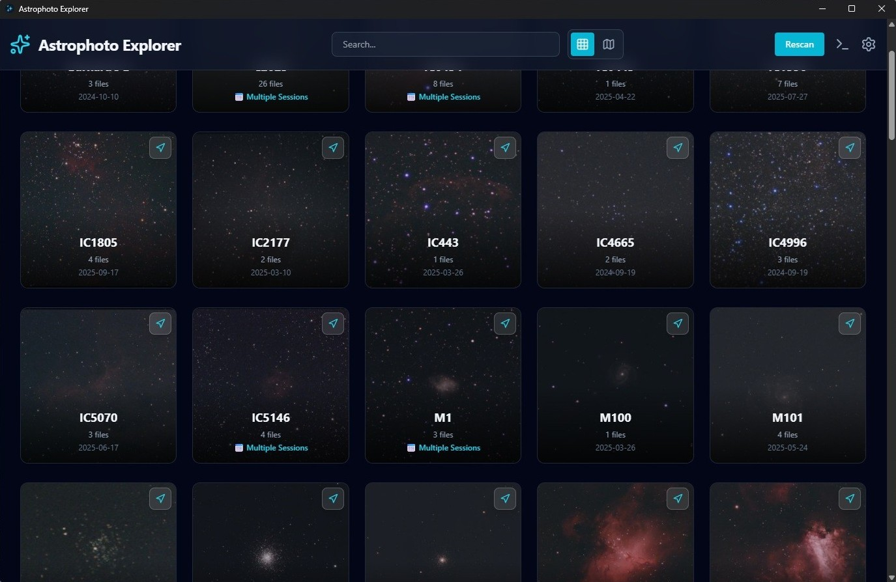
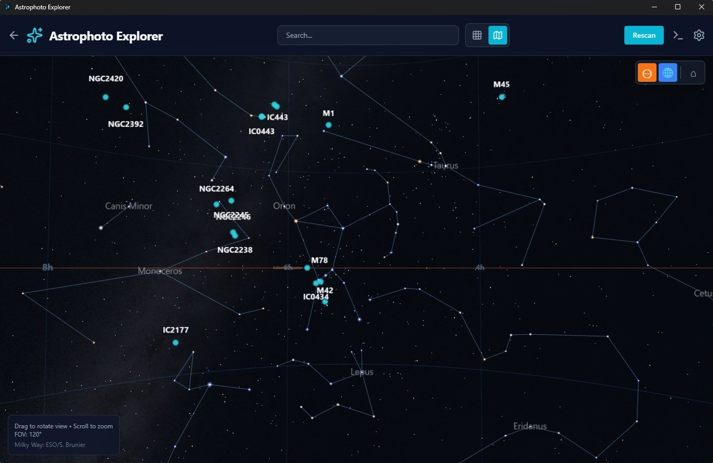
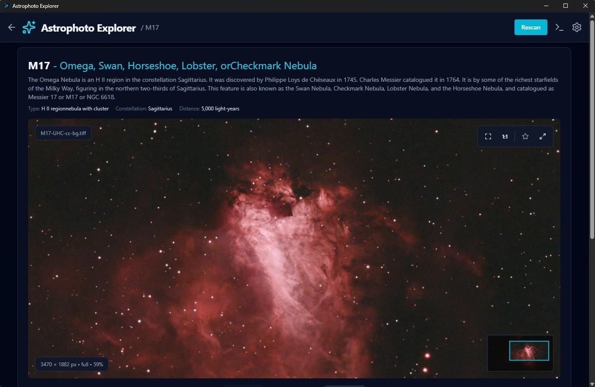
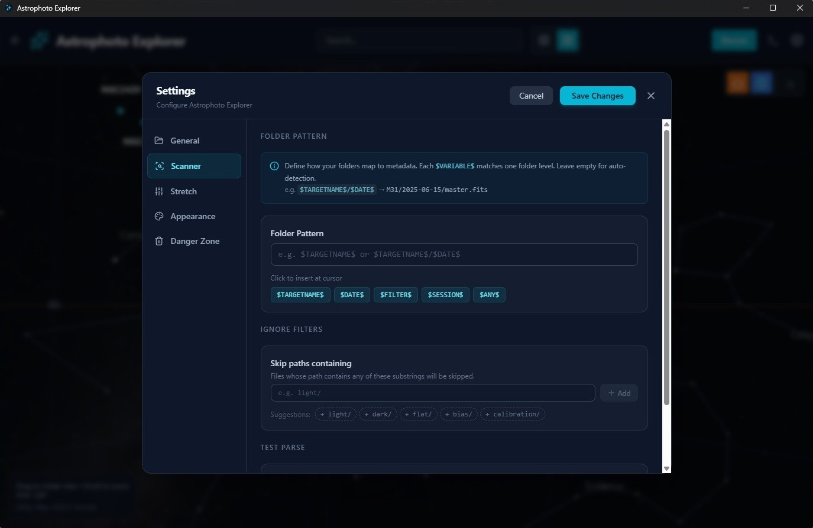

# 🌌 Astrophoto Explorer

A modern dual-stack application for exploring local FITS astronomical imagery using Python (FastAPI + Astropy) and React (Vite + Three.js).

## Features

- **FITS File Scanner**: Automatically scans folders for FITS files and extracts header metadata.
- **Real-time Progress**: WebSocket-based stdout/stderr streaming and progress updates during catalog scanning.
- **Interactive 3D Sky Map**: Embedded Three.js-based sky map rendering constellations, celestial grids, equator, and star positions.
- **Favorite Images**: Mark specific images per object as favorites for thumbnails and default views.
- **Smart Object Naming**: Prioritizes catalog naming hierarchies (Messier > NGC > Caldwell > IC) with astronomical cross-referencing.
- **Z-Scale Normalization**: Employs Astropy's ZScaleInterval for appropriate astronomical image display.
- **MTF Autostretch**: Advanced stretching algorithms for better visualization of faint nebulosity.
- **Glassmorphism UI**: Modern dark-mode interface with slate panels and backdrop blur effects.
- **Metadata Editor**: Edit and write custom astronomical metadata headers directly back to FITS files.
- **Fast Preview Generation**: Lazy-loads FITS image pixels only when a preview is generated.
- **Multi-session Support**: Groups observation images by deep-sky object across observation dates/sessions.

## Screenshots

<details>
  <summary>📸 Click to view application screenshots</summary>
  <br/>

  ### Grid View
  _Organized layout of scanned FITS astronomical images grouped by deep-sky object catalog name._
  

  ### Interactive 3D Sky Map
  _Interactive celestial sphere mapping constellations, grids, equatorial lines, and celestial coordinates._
  

  ### Image Preview & Autostretch Panel
  _Advanced Z-Scale and MTF stretch options with real-time previewing and interactive FITS metadata editing._
  

  ### Settings & Themes Configuration
  _Configuration panel for scanner settings, folder selections, and custom styling themes._
  

</details>

## Tech Stack

- **Backend**: FastAPI + Astropy + NumPy + PyONGC + PyWebView
- **Frontend**: React + Vite + Tailwind CSS + Lucide Icons + Three.js
- **Python Environment**: pipenv / virtualenv
- **Dev Tools**: Concurrently for dual-server orchestration

## Setup & Development

### Prerequisites

- **Python**: Version 3.11+
- **Node.js**: Version 18+

### Development Environment Setup

1. **Install Dependencies**:
   ```bash
   # Install Python dependencies using pipenv
   pipenv install

   # Install Node dependencies
   npm install
   ```

2. **Run Development Server**:
   ```bash
   npm run dev
   ```
   This command starts the FastAPI backend (on port 8000) and the Vite frontend dev server (on port 5173) concurrently.
   - Open browser to: `http://localhost:5173`

### Production Windows Executable Build

On Windows machines, the application can be built into a self-contained, portable desktop application with a native GUI wrapper (via PyWebView):

1. Run the build script:
   ```cmd
   scripts\build.bat
   ```
2. The script will:
   - Create a clean local Python virtual environment (`.venv`).
   - Install required pip dependencies.
   - Compile the React frontend into static assets.
   - Run PyInstaller using `standalone_api.spec` to package the FastAPI backend and static UI.
   - Stage the final portable build in `build/AstrophotoExplorer/`.
3. To run the bundled app, navigate to `build/AstrophotoExplorer/` and run `astrophoto-explorer.exe` (or double-click `start.bat`).

---

## Project Structure

```
astrophoto-explorer/
├── backend/
│   ├── data/            # Deep-sky catalog databases (NGC, IC, Messier, Caldwell)
│   ├── scripts/         # Database build and cleaning utility scripts
│   ├── astro_info.py    # Astropy coordinate calculations and celestial object lookup
│   ├── astrometry.py    # Coordinate transformations and FITS alignment helpers
│   ├── cache_manager.py # Stretches caching, favorites persistence, and local cache paths
│   ├── cross_reference.py # Catalog alias matching (e.g. mapping NGC 224 to M31)
│   ├── image_preview.py # Astropy FITS ZScale and MTF stretch processing
│   ├── main.py          # FastAPI routes, static assets server, and log-capturing websockets
│   ├── metadata_extractor.py # Astropy FITS header reader
│   ├── metadata_writer.py # Saves modified metadata back to FITS files
│   ├── object_naming.py # Path-based object name detection and standard format filters
│   ├── scanner.py       # FITS scanning logic with real-time WebSocket progress updates
│   ├── stretch.py       # Advanced MTF (Midtone Transfer Function) stretching mathematical functions
│   ├── thumbnail_generator.py # Thumbnail extraction for list views
│   └── websocket_manager.py # WS connections organizer
├── docs/
│   └── screenshots/     # Clean, metadata-stripped application screenshots
├── frontend/
│   └── src/
│       ├── api/         # Axios-free vanilla JS fetch client configurations
│       ├── components/  # Main UI Panels (Header, Grid, Sidebar, Terminal Console, Settings)
│       ├── hooks/       # React State synchronization hooks
│       ├── skymap/      # 3D Star Map rendering modules (Stars, Grid, Constellation Lines, Equator)
│       ├── utils/       # Formatter scripts
│       ├── App.jsx      # Main GUI layout and controller state
│       ├── index.css    # Global stylesheet importing Tailwind layers
│       └── main.jsx     # React index mount
├── public/
│   └── assets/
│       └── data/        # Star coordinate maps and constellation lines accessed by 3D map
├── scripts/
│   ├── build.bat        # Windows single-click builder and production compiler
│   ├── build_prep.py    # Python standalone installer prep utilities
│   ├── create_icon.py   # Image to ICO icon format converter utility
│   ├── generate_icon.py # Sparkles application icon generator matching the UI design
│   └── package_app.py   # Stager script for moving executables and config configurations
├── Pipfile              # Pipenv package manifest
├── package.json         # Node packaging metadata and scripts
└── README.md            # Developer documentation
```

---

## API Endpoints

- `GET /api/scan?path={folder}` - Scan folder for FITS files.
- `GET /api/preview/{file_path}` - Generate auto-stretched preview image.
- `POST /api/metadata/save` - Save updated metadata headers to FITS.
- `GET /api/thumbnail/{file_path}` - Generate or fetch a cached file thumbnail.
- `WS /ws/logs` - Streaming log console connection for real-time app logging.
